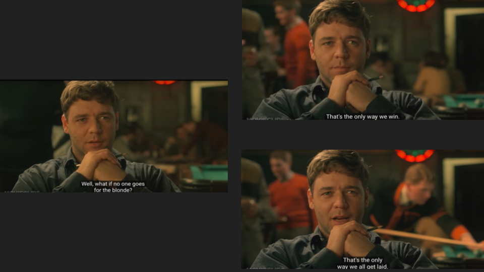

## Roundtable: **Like Rape: Coercion, Comparison, and Sexual Harm**
_organized by Arthur Z. Wang and [Samantha Pergadia](https://www.smu.edu/Dedman/Academics/Departments/English/People/Faculty/SamanthaPergadia)_
