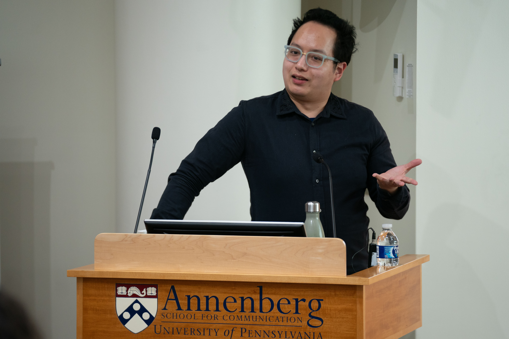

## Presentation Abstract

This presentation examines biographical media by and about African American space scientists as an alternative to two longstanding visions of race in the cosmos: a progressive model of outer space as utopian departure from earthly oppression and a cyclical model of outer space as defamiliarized recapitulation of historical violence and inequality. Across memoirs, documentaries, profiles, and interviews of Black astronauts and astrophysicists, this talk elaborates a common mode of ironic speculation that draws as much from commentary and criticism in the Black press as it does from Black science fiction. 

This work also advances a broader study of the scientific biography’s negotiation between an ideal of scientific impersonality and a hunger for scientists’ life stories in academic and popular cultures. While biographer Ira B. Nadel has suggested that the genre’s appeal relies on a formally conservative insistence on the "coherence of life and comprehensibility of experience," this collection of biographical media instead frames scientific lives through dissonant juxtapositions between Afrofuturist wonder and the earthly politics of stargazing while Black.

Event Photographs by Kyle Cassidy