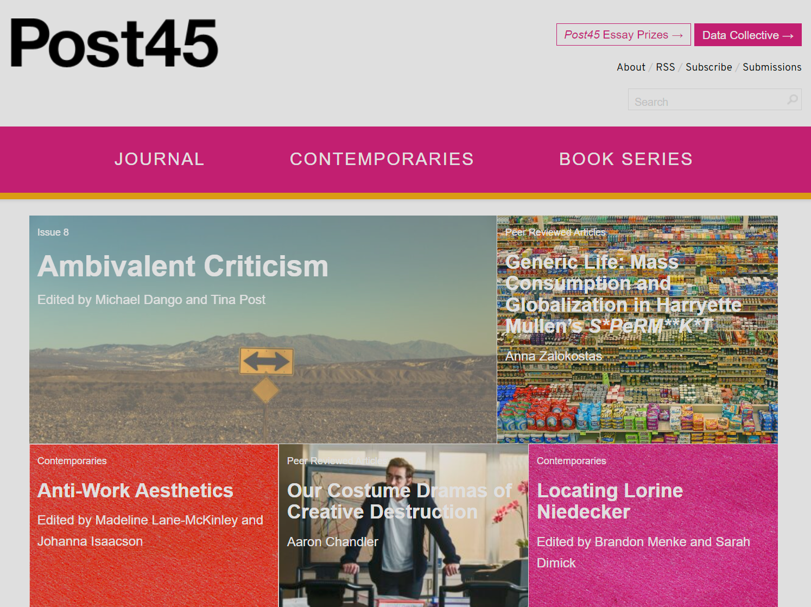
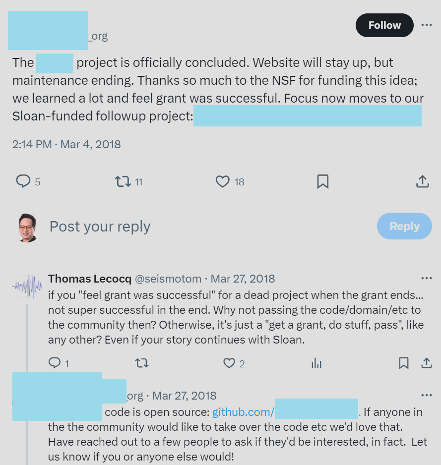
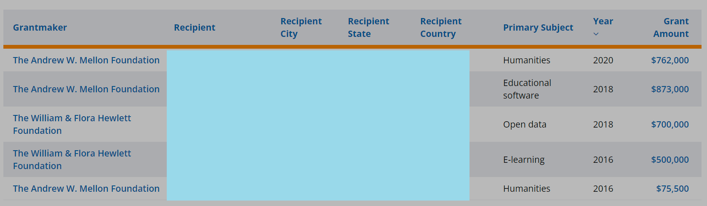
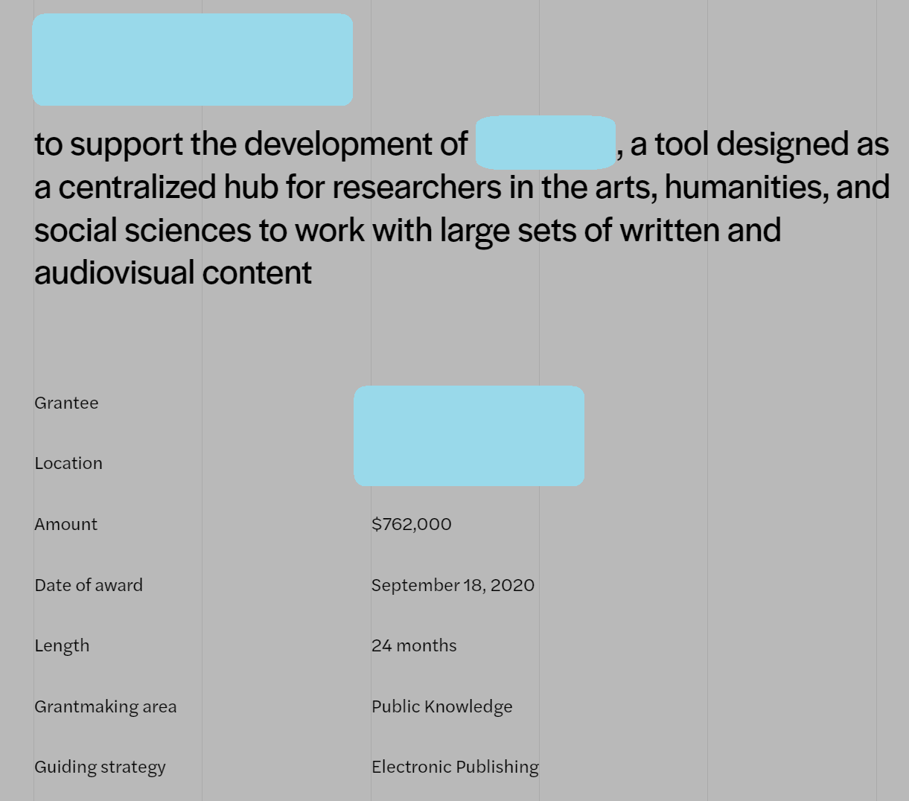

## [Post45](https://post45.org)
- peer-reviewed journal for scholarship on postwar American literature and culture
- diamond open access & online only
- independent (not published by a university press)
- irregular publication schedule (immediate publication, no backlog)
  - single articles (2011-2019)
  - single articles & special issues (2019-present)

### Finding an article from 2011
Paul K. Saint-Amour, "[Counterfactual States of America: On Parllel Worlds and Longing for the Law](https://post45.org/2011/09/counterfactual-states-of-america-on-parallel-worlds-and-longing-for-the-law/)," _Post45_, September 20, 2011.

### Planned Improvements
- [Navigation](https://github.com/Post45-Journal/Projects/issues/5)
- [Indexing](https://github.com/Post45-Journal/Projects/issues/37)
- [Transparency](https://arthurzwang.com/project/post45-data-viz)
- [Membership and Community](https://github.com/Post45-Journal/Projects/issues/32)

## Special Issue Database
- Problem: lack of transparency/observability around special issues (disciplinary history & CFPs)
- Bad browsing: _PMLA_
  - [PMLA on JSTOR](https://jstor.org/journal/pmla)
  - [PMLA / Publications of the Modern Language Association of America](https://www.cambridge.org/core/journals/pmla/all-issues)
- Better but still bad: *Representations*
  - [*Representations* Special Issues (Journal Website)](https://online.ucpress.edu/representations/pages/special_issues) (since 2001)
  - [*Representations* on JSTOR](https://www.jstor.org/journal/representations) (spotty -- none listed between 2001 and 2011, 17 special issues in that interval)
  - [*Representations* in MLA International Bibliography](https://web-p-ebscohost-com.proxy.library.upenn.edu/ehost/resultsadvanced?vid=4&sid=d4a4f578-3232-43be-819c-9b78fbb555d6%40redis&bquery=SO+representations+AND+%22special+issue%22&bdata=JmRiPW16aCZ0eXBlPTEmc2VhcmNoTW9kZT1BbmQmc2l0ZT1laG9zdC1saXZl) (also spotty: earliest listed is volume 20, missing volumes 9, 14, and 17)
  
- [Preliminary sketch for special issue app (October 2022)](https://wang-arthur.github.io/special-issues/)

<!-- ## (If there's time) DH Project End-of-Life / Postmortem
- Failing gracefully: [best practices from the Linux Foundation: "Winding Down an Open Source Project"](https://www.linuxfoundation.org/resources/open-source-guides/winding-down-an-open-source-project)
- From 6- and 7-figure funding to abandonware
- Example 1: $300K NSF Grant
  - 
  - 

- Example 2: Foundation with $2.9M grant funding, $1.6M specifically for open source software/platform
  - 
  - 
  -  -->